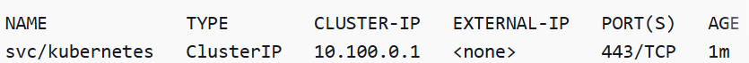

# EKSClusterCreationTerraform
Simple EKS cluster creation with EKS managed nodes

# Prerequisites
* User should have the AWS Account - https://docs.aws.amazon.com/accounts/latest/reference/manage-acct-creating.html
* Git should be installed.
    * https://git-scm.com/downloads/win - for Windows
    * https://git-scm.com/downloads/linux - for Linux
* Kubectl should be installed - https://docs.aws.amazon.com/eks/latest/userguide/install-kubectl.html
* Terraform should be installed - https://developer.hashicorp.com/terraform/install
* AWSCLI should be installed - https://docs.aws.amazon.com/cli/latest/userguide/cli-chap-install.html
* IAM User to create cluster - if you want to setup the cluster using root user then this step is optional - https://docs.aws.amazon.com/IAM/latest/UserGuide/id_users_create.html

# Steps to use the code

1. Clone the repo.
2. Navigate to the direcotry EKSClusterCreationTerraform
3. change the default variables if required as per your requirement.
4. Execute the following terraform commands.
    * terraform init
    * terraform plan - please check what all resources are being created.
    * terraform apply - approve the execution.
5. Check the resources in AWS.
6. Configure your system to comminicate with your cluster with the following command.
    * aws eks update-kubeconfig --region <em>region-code</em> --name </em>my-cluster</em>
    * kubectl get svc - You should get the following result
     
    if you are unable to get the result, add the IAM user in access tab of cluster - https://docs.aws.amazon.com/eks/latest/userguide/creating-access-entries.html

# Sanity testing

1. Check whether the nodes are ready or not using the following command.
    * kubectl get nodes
2. If ready, terminate the node from EC2 console, new node should be launched automatically and check whether the new instance is ready or not.
2. Create a deployment with nginx image
            